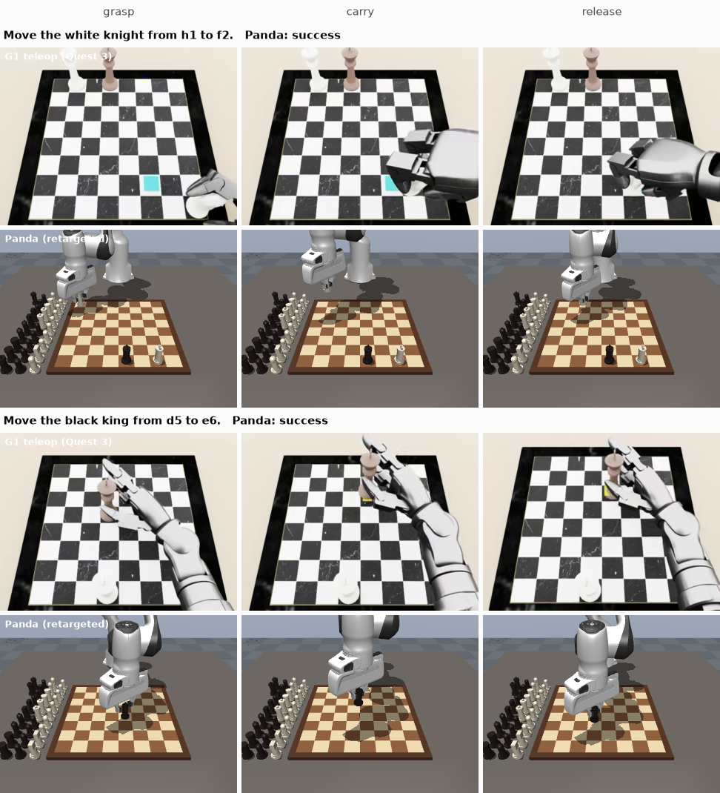
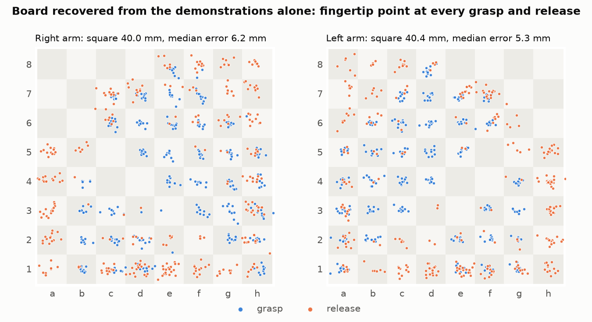
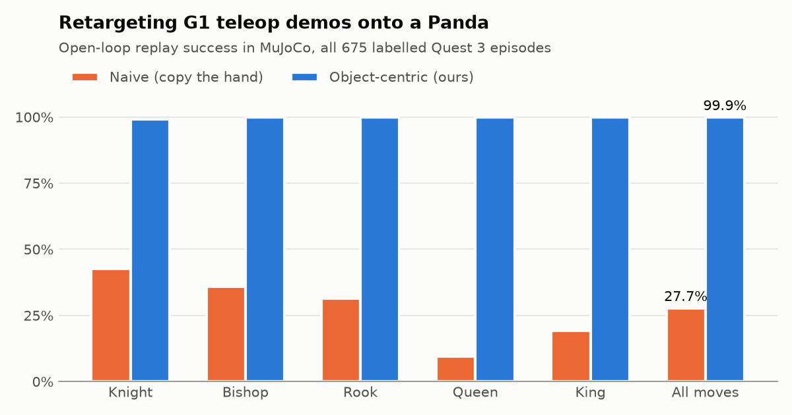
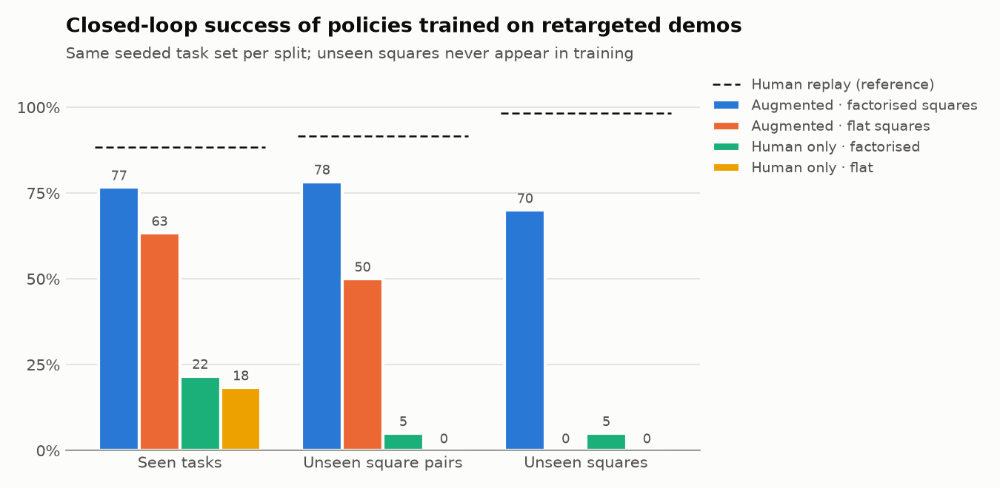
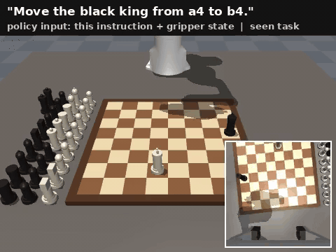
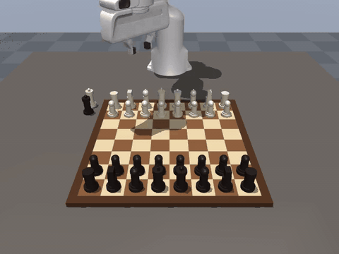

# From a humanoid's hands to a Panda's gripper: chess moves learned from my Quest 3 teleoperation

I collected **676 chess-move demonstrations with a Meta Quest 3**, teleoperating a simulated
Unitree G1 humanoid with dexterous Dex3 hands (both arms, five piece types). The motion is real:
my own hands, tracked by the headset; the robot it drove was simulated. This project uses that data to
drive a **Franka Panda with a parallel-jaw gripper** in a MuJoCo chess simulator, and to train
policies that execute language instructions such as *"Move the black knight from b8 to c6."*

The interesting part is the gap between the two embodiments: a five-fingered humanoid hand that
pinches crowns and wraps around knights, versus a two-finger gripper with a 21 cm palm. The
pipeline closes that gap step by step and measures each step.

<p align="center"></p>

**Headline results**

| | |
|---|---|
| Board pose recovered from the demos alone | square size **39.97 / 40.43 mm** (left/right arm, true 40 mm), median fingertip error **≈5 mm** |
| Naive retargeting (copy the hand path) | **30.8 %** of 675 demos succeed on the Panda |
| Object-centric retargeting (keeps the human's timing, path and yaw) | **94.8 %** succeed |
| Board-symmetry augmentation | 469 human demos → **3 015** sim-verified training episodes (augmented copies succeed as often as originals: 94.3 % vs 93.6 %) |
| Policy trained on them, closed loop | **77 % / 78 % / 70 %** on seen tasks / unseen square pairs / squares never seen in training (flat square embeddings: 0 % on unseen squares; no augmentation: ≤ 22 %) |
| Whole game | Morphy's *Opera Game* (1858), 33 plies played with my recorded hand motions: 29 / 34 piece moves succeed unassisted, 6 interventions |

---

## 1. The data I collected

| | |
|---|---|
| Hardware | Meta Quest 3 hand tracking → simulated Unitree G1 (Dex3-1 hands), one arm at a time |
| Datasets | [`Raysolo/fb32-v03-all5-right`](https://huggingface.co/datasets/Raysolo/fb32-v03-all5-right), [`Raysolo/fb32-v03-all5-left`](https://huggingface.co/datasets/Raysolo/fb32-v03-all5-left) (LeRobot v3) |
| Size | 676 episodes (338 per arm), 180 k frames at 50 Hz, ≈ 5 s per move |
| Tasks | knight, bishop, rook, queen, king; white and black; one move per episode on a sparse board, with a language instruction and the starting FEN |
| Signals | wrist pose of both arms, 14 Dex3 finger joints, head and wrist camera video |

Two grasp styles show up in the data (checked against the head camera): a **power grasp** that
closes the whole hand (knights, bishops, rooks), and a **thumb-index pinch** on the crown (most
kings and queens). That difference matters later.

## 2. Recovering the board from the demonstrations

The recordings contain the wrist pose but not where the board was. Every episode does say which
two squares were touched, though, and the hand tells us when. Assuming a level board and a fixed
fingertip offset `o` in the wrist frame, at every grasp and release

```
p_wrist[:2] + (R_wrist · o)[:2] = origin + A · [file, rank]
```

which is **linear** in the 9 unknowns (origin, the 2×2 board axes `A`, and `o`): 1 350 events,
one least-squares solve (`chessbot/calibration.py`). Grasp timing is bootstrapped from the
unambiguous power grasps, then every episode is re-segmented by its closest low approach to the
labelled squares and the fit is repeated.

<p align="center"></p>

* The fitted square is **39.97 mm** (right arm) and **40.43 mm** (left); the board is 32 cm.
* The fitted fingertip offset is (14, ±4, 0.6) cm in the wrist frame, **mirrored** between the
  two hands, as it physically should be.
* The two arms were fitted independently and place the same board within 12 mm of each other.
* Grasp heights come out ordered by piece: rook 19 mm < bishop 23 < knight 25 < queen 29 < king 36.

## 3. Cross-embodiment retargeting

Both robots play on a chessboard, so the shared frame is the **board**: each demonstration is
expressed as a continuous (file, rank, height) trajectory of the fingertip point, then re-embodied
on the Panda's board (`chessbot/retarget.py`).

<p align="center"></p>

| | Naive | Object-centric |
|---|---|---|
| What it does | scale the fingertip path to the Panda board, gripper yaw from the wrist heading, gripper width from hand closure | keep the human's **timing, path shape and yaw**; pin the grasp/release keyframes to the piece; Panda-specific contact funnels |
| Success (675 episodes) | **30.8 %** | **94.8 %** |
| Main failure | piece dropped on the wrong square (238), off-centre (141), never released (75) | not released (17), off-centre (10) |

The naive version fails for reasons that are informative about the embodiment gap:
a dexterous hand approaches a piece diagonally from the side, which a parallel gripper does with a
finger *into* the piece; the human pinch relaxes during transport (fine for a humanoid hand,
fatal for a width-controlled gripper); and the hand's closure signal does not say *when* a pinch
releases.

How the object-centric retargeter got from 54 % to 95 % (first 60 episodes, in order):

| Change | Success |
|---|---|
| Keyframes pinned to the piece, MimicGen-style offset blending | 54 % |
| + vertical pre-grasp / pre-place funnels and clearance above standing pieces | 63 % |
| + "arrive" dwell before actuating the fingers (the arm lags its rate-limited target) | 95 % |

Everything a human contributes survives: *when* to grasp and release, the transport path and
speed profile, and the wrist yaw. Only the last few centimetres of contact are adapted to the
gripper.

## 4. The simulator

There is no chessboard in LIBERO, and chess needs millimetre-level placement on 64 named
squares, so I built a small MuJoCo environment (`chessbot/env.py`, `chessbot/scene.py`):
Menagerie's Panda, a 40 cm board with 5 cm squares, a pool of 34 primitive pieces loaded from any
FEN, a damped-least-squares IK on the fingertip pinch point, and a 20 Hz absolute Cartesian
action `[x, y, z, yaw, width]`. A move counts as successful only if the piece ends centred on the
target square, upright, released, with **no other piece disturbed**.

Designing for the Panda hand forced some decisions:

* **Piece geometry follows the hand.** The finger pads span 17 mm and the palm sits 37 mm above
  the pinch point, so every piece has a straight grip band at its grasp height and its top within
  33 mm of it. The first king design was pressed into the board by the palm.
* **Yaw matters on a crowded board.** The palm is 21 cm long along the finger axis; picking a
  bishop next to a king means rotating the gripper so the palm clears it (`chessbot/oracle.py`).
* **Grasp stabiliser (a disclosed simplification).** Menagerie's fingertips have small "bump"
  colliders whose corners wedge cylinders sideways; I removed them. Even with flat pads, MuJoCo's
  soft contacts let a pinched piece creep ~1 cm along the pads during fast transport, independent of
  friction (tested: noslip solver, cone type, condim, friction, contact stiffness). So once both
  pads squeeze a piece it is welded to the hand at its current offset, and released when the
  fingers open. Approach, contact, collisions, placement and release stay physical.

## 5. Multiplying demonstrations with the board's symmetries

Translating a move (src + v, dst + v), or mirroring files, keeps it legal for its piece, and
because the human trajectory lives in board coordinates the whole motion moves with it
(`chessbot/augment.py`). Each demo was re-anchored to 4 random symmetric copies and every copy
was replayed on the Panda; only successful rollouts were kept.

* 3 375 rollouts → 3 178 successful; 3 015 in the training split (469 human + 2 546 augmented).
* Augmented copies succeed at the same rate as the originals (94.3 % vs 93.6 %), which is a
  useful check that the re-anchoring preserves motion quality.

**Held-out evaluation** (`chessbot/splits.py`): six squares (b6, c3, d7, e2, f5, g4) never
appear in training, as source or destination, and ~10 % of (piece, source, destination)
combinations are held out among the rest.

## 6. Policies

**Compact task-conditioned policy** (`chessbot/policy.py`, trains on a laptop CPU in minutes).
The instruction is parsed into piece, colour, source and destination; the network sees the
end-effector state and predicts 10-step chunks of Cartesian commands (receding horizon). Squares
are encoded either **factorised** (file embedding + rank embedding) or **flat** (one embedding per
square).

<p align="center"></p>

60 tasks per split, the same seeded tasks and starting positions for every model, one training
seed each (with n = 60 the standard error is about ±6 points):

| Policy | Training episodes | Seen tasks | Unseen square pairs | Unseen squares |
|---|---|---|---|---|
| *Retargeted human replay (reference, not a policy)* | | *88.3 %* | *91.7 %* | *98.3 %* |
| **Augmented · factorised squares** | 3 015 | **76.7 %** | **78.3 %** | **70.0 %** |
| Augmented · flat squares | 3 015 | 63.3 % | 50.0 % | 0.0 % |
| Human only · factorised squares | 469 | 21.7 % | 5.0 % | 5.0 % |
| Human only · flat squares | 469 | 18.3 % | 0.0 % | 0.0 % |

Two things stand out. **Augmentation is what makes learning work**: 469 human demonstrations, one
per move, are far too few for a policy to learn where 64 squares are, while their symmetric copies
are enough. And **the square encoding decides generalisation**: with one embedding per square, a
square never seen in training is simply unknown (0 %); composing it from a seen file and a seen
rank gets 70 %.

<p align="center"><br>
<em>The factorised policy given only the instruction and the gripper state: a seen task, an unseen
square pair, and two moves involving squares never seen in training (d7, e2). Inset: wrist camera.</em></p>

**SmolVLA.** `notebooks/smolvla_colab.ipynb` renders the training rollouts into a LeRobot dataset
(front + wrist cameras, 256×256) and fine-tunes `lerobot/smolvla_base` on a Colab GPU, then runs
the same closed-loop evaluation from images and the raw instruction (`scripts/eval_smolvla.py`).

## 7. Playing a whole game with my hand motions

`scripts/play_game.py --player human` plays Morphy's *Opera Game* (Paris 1858, 33 plies, captures,
queenside castling, a queen sacrifice and mate). For every move it retrieves one of my
demonstrations with the same piece and move vector (or its mirror image), re-anchors it to the
game's squares and executes it with the object-centric retargeter. Pawns are not in my data, so
they borrow the motion of a piece making the same step. Captured pieces are removed by the
environment rather than by the robot.

<p align="center"></p>

| | |
|---|---|
| Plies | 33 (one castling, twelve captures) |
| Single-piece moves succeeding unassisted | 29 / 34 (85 %) |
| Interventions (a piece snapped back onto its square so the game can continue) | 6 |

The failures cluster in the crowded endgame: captures and long moves to the back rank
(Qxf3, Rxd7, Qb8+, Nxb8, Rd8#). My demonstrations were recorded on sparse boards with three
pieces, so a full board is a real distribution shift for motions that were never meant to thread
between neighbours.

## What worked, what didn't

**Worked**
* Treating the **board as the shared frame** between embodiments: calibration, retargeting,
  augmentation and evaluation all live in it.
* Recovering the board by **linear least squares** with the fingertip offset as an unknown.
* **Object-centric retargeting**: keeping the human's timing and path, adapting only contact.
* **Symmetry augmentation verified in simulation**, and **factorised square embeddings** for
  generalising to squares never seen in training.

**Didn't work, or only partly**
* Grasp detection from finger closure alone: it fails on pinch grasps (the fingers barely move
  and relax during the carry). The task labels fixed it.
* Naive retargeting (30.8 %), for the reasons above.
* Pure contact physics for carrying pieces: see the grasp stabiliser note.
* The first object-centric version opened the gripper while the arm was still moving (54 %).
* Crowded full boards are harder than the sparse boards in the demos: palm clearance and
  occasional knocked neighbours; the game script counts every intervention.

**Limitations**
* The compact policy reads a parsed instruction and proprioception, not images; SmolVLA is the
  vision-language version.
* Captures, castling and promotion are decomposed into single-piece moves; captured pieces are
  removed by the environment.
* All results are in simulation: one MuJoCo Panda, one board geometry.

## Reproduce

```bash
git clone https://github.com/rayrsys/Humanoid-Challenge-.git && cd Humanoid-Challenge-
python -m venv .venv && source .venv/bin/activate
pip install -e ".[train,figures,dev]"
python scripts/download_data.py                     # teleop parquet + metadata (~50 MB)
export MUJOCO_GL=egl                                # osmesa on headless CPU, glfw on a desktop

python scripts/calibrate_board.py                   # board pose from the demos -> calib/
python scripts/replay.py --mode naive               # retargeting baseline
python scripts/replay.py --mode object_centric
python scripts/generate_demos.py --aug-per-demo 4   # sim-verified human + augmented rollouts
python scripts/train_policy.py --encoding factorised --out checkpoints/aug_factorised.pt
python scripts/eval_policy.py --reference --ckpt checkpoints/aug_factorised.pt --n 60
python scripts/play_game.py --player human --video outputs/opera_game.mp4
python scripts/make_figures.py
pytest -q
```

The Menagerie Panda model is fetched automatically on first use. SmolVLA: open
`notebooks/smolvla_colab.ipynb` in Colab with a GPU runtime and run all cells.

## Repository layout

```
chessbot/
  env.py, scene.py, board.py, ik.py   MuJoCo chess environment
  quest_data.py                       loader for the Quest 3 / G1 teleop datasets
  calibration.py                      board pose from demonstrations
  retarget.py                         naive and object-centric retargeting
  augment.py, splits.py               board-symmetry augmentation, held-out splits
  policy.py                           compact task-conditioned policy
  player.py, game.py, oracle.py       full games: human-motion player, chess rules, scripted reference
scripts/                              one script per step above
notebooks/smolvla_colab.ipynb         SmolVLA fine-tuning and evaluation on Colab
calib/                                fitted board calibrations
artifacts/train_rollouts.jsonl.gz     the 3 015 sim-verified training rollouts
docs/                                 figures
```
